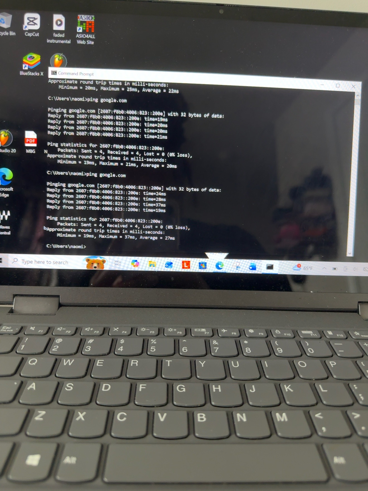
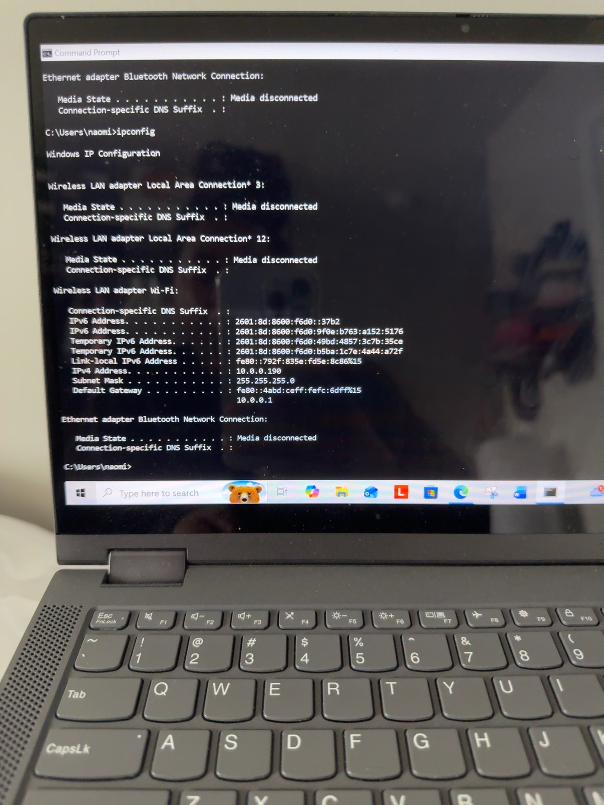
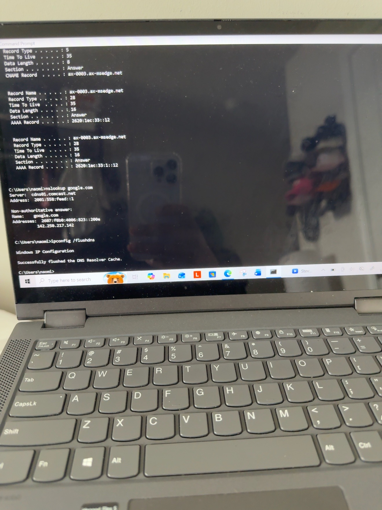

# Network Troubleshooting Lab

## Scenario
A Windows computer was experiencing network connectivity issues. The goal of this home lab was to practice diagnosing IPv4/DHCP and DNS connectivity, restore the network configuration, and verify connectivity.

## Environment
- Windows 10
- Command Prompt
- Wi-Fi connection
- IPv4 / TCP/IP
- DHCP
- DNS

## 1. Established a Working Baseline

Before making changes, I tested connectivity using:

`ping google.com`

The test returned 4 successful replies with 0% packet loss, confirming that the computer had a working network connection.

## 2. Released the IPv4 Configuration

I used:

`ipconfig /release`

This released the computer's current IPv4 configuration so I could simulate and troubleshoot a network configuration issue.

## 3. Renewed the IPv4 Address

I requested a new IPv4 configuration from DHCP using:

`ipconfig /renew`

I then used:

`ipconfig`

The Wi-Fi adapter showed an IPv4 address and default gateway again, confirming that the network configuration had been renewed.

## 4. Verified IPv4 Connectivity

I tested IPv4 connectivity using:

`ping -4 google.com`

The test returned successful replies, confirming that IPv4 internet connectivity was working after the renewal.

## 5. Tested DNS Resolution

I used:

`nslookup google.com`

The command successfully returned IP addresses for the domain, confirming that DNS name resolution was working.

## 6. Flushed the DNS Resolver Cache

I cleared the local DNS resolver cache using:

`ipconfig /flushdns`

Windows confirmed that the DNS Resolver Cache was successfully flushed.

## 7. Verified DNS After the Change

I ran:

`nslookup google.com`

again and confirmed that the domain continued to resolve successfully.

## Resolution

The IPv4 configuration was successfully renewed through DHCP and internet connectivity was verified. DNS resolution was tested, the local DNS resolver cache was cleared, and DNS resolution continued to function afterward.

## Commands Used

- `ipconfig`
- `ipconfig /release`
- `ipconfig /renew`
- `ping google.com`
- `ping -4 google.com`
- `ipconfig /displaydns`
- `nslookup google.com`
- `ipconfig /flushdns`

## Skills Practiced

- Windows network troubleshooting
- TCP/IP fundamentals
- IPv4 configuration
- DHCP troubleshooting
- DNS troubleshooting
- Command Prompt
- Ping and connectivity testing
- DNS name resolution
- Root cause troubleshooting
- Verification and testing
- Technical documentation

## What I Learned

This lab gave me hands-on practice using Windows networking commands to troubleshoot connectivity. I practiced establishing a working baseline, releasing and renewing an IPv4 configuration through DHCP, testing IPv4 connectivity, checking DNS resolution, clearing the DNS resolver cache, and verifying connectivity after troubleshooting.
