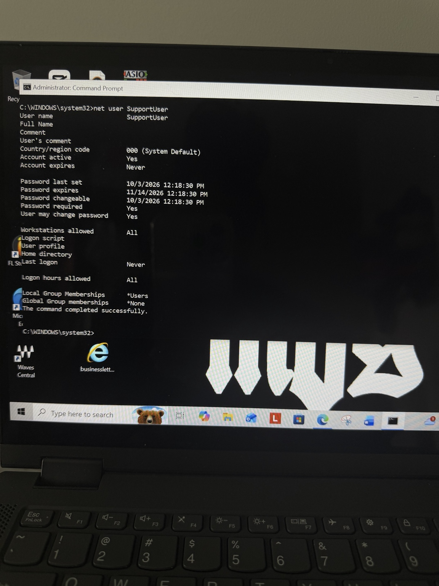
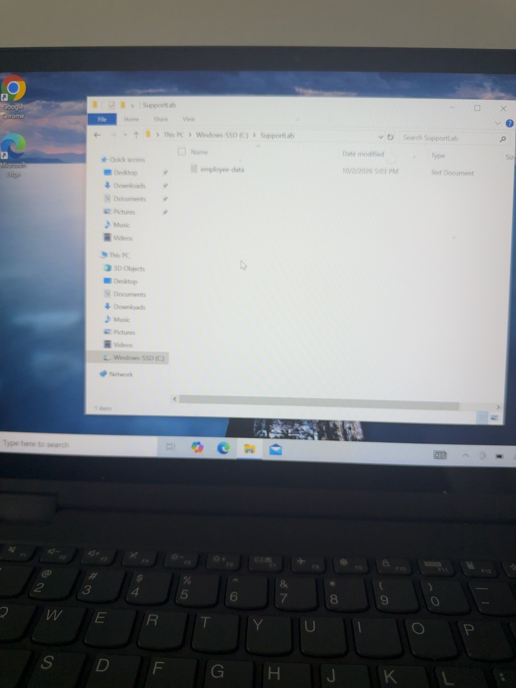

# Windows User Account Troubleshooting Lab

## Scenario
A user was unable to sign in to their Windows account. The goal was to identify the account issue, restore access, and verify that the user could successfully sign in.

## Environment
- Windows 10
- Local Windows user account
- Administrator Command Prompt
- Standard user account: SupportUser

## Troubleshooting Process

### 1. Created and Verified the User Account
I created a standard local user account named `SupportUser` and used `net user SupportUser` to verify the account configuration.

### 2. Simulated the Login Issue
I disabled the SupportUser account to simulate a user being unable to sign in.

### 3. Identified the Problem
I used:

`net user SupportUser`

The account information showed that `Account active` was set to `No`, confirming that the account had been disabled.

### 4. Restored the Account
I re-enabled the account using:

`net user SupportUser /active:yes`

### 5. Verified the Account Status
I ran `net user SupportUser` again and confirmed that `Account active` was now set to `Yes`.

### 6. Verified Successful Login
I signed into the SupportUser account to confirm that the user could successfully access the Windows desktop.

## Resolution
The login issue was caused by the local user account being disabled. After identifying the issue and re-enabling the account, I verified the account status and successfully signed in as the affected user.

## Skills Practiced
- Windows user account management
- Command Prompt
- `net user`
- Account troubleshooting
- User access management
- Root cause identification
- Issue resolution
- Verification and testing
- Technical documentation

## What I Learned
This lab gave me hands-on practice troubleshooting a Windows user account issue from beginning to end. I practiced checking account status from the command line, identifying a disabled account, restoring access, and verifying the solution by signing into the affected account.
