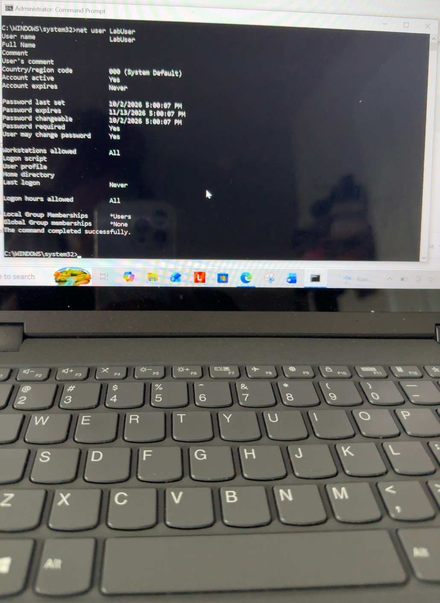
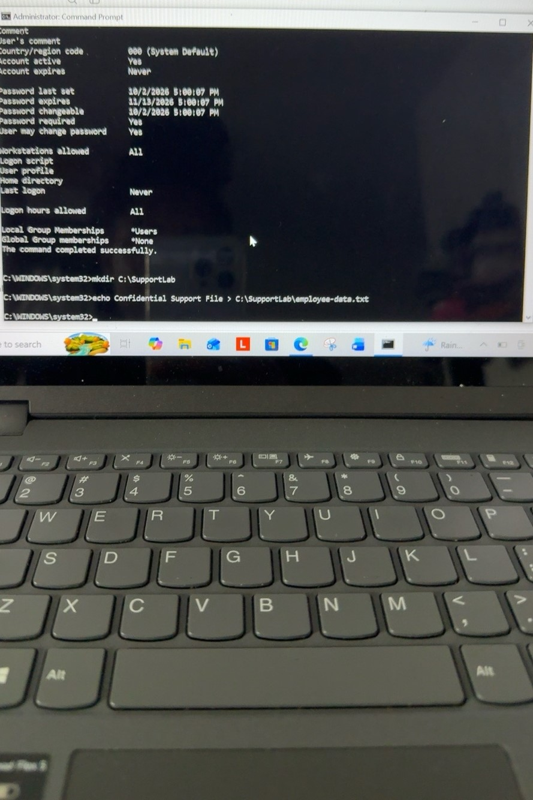
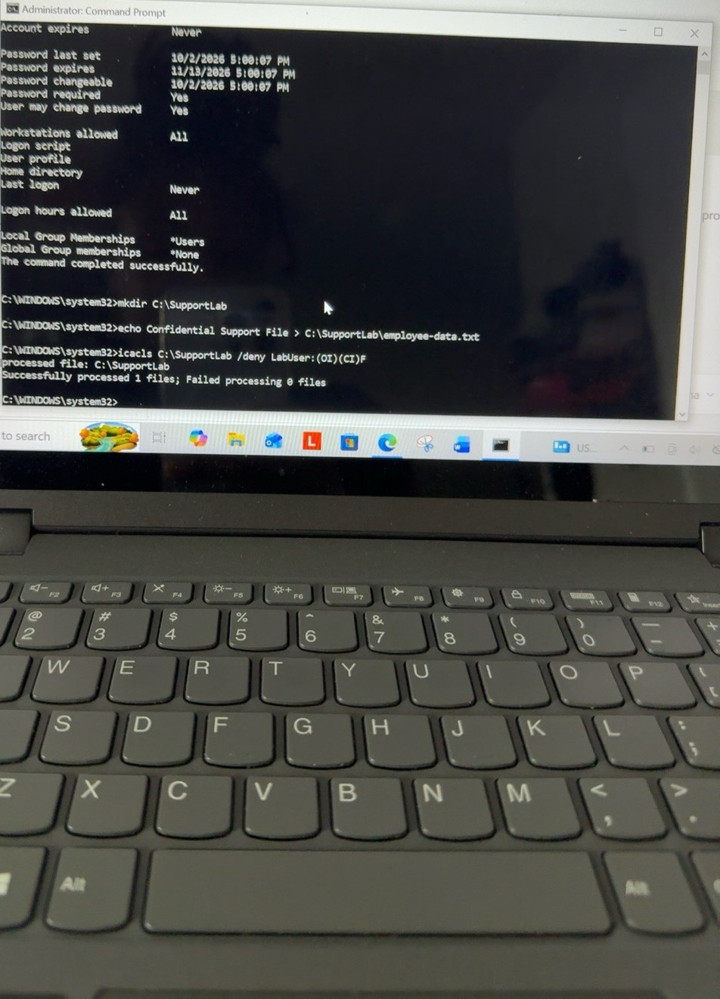
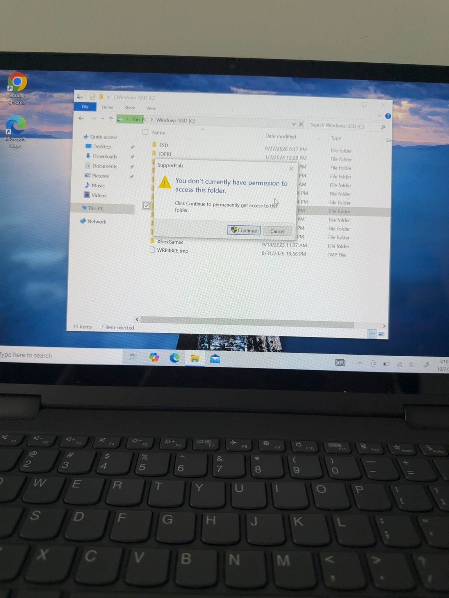
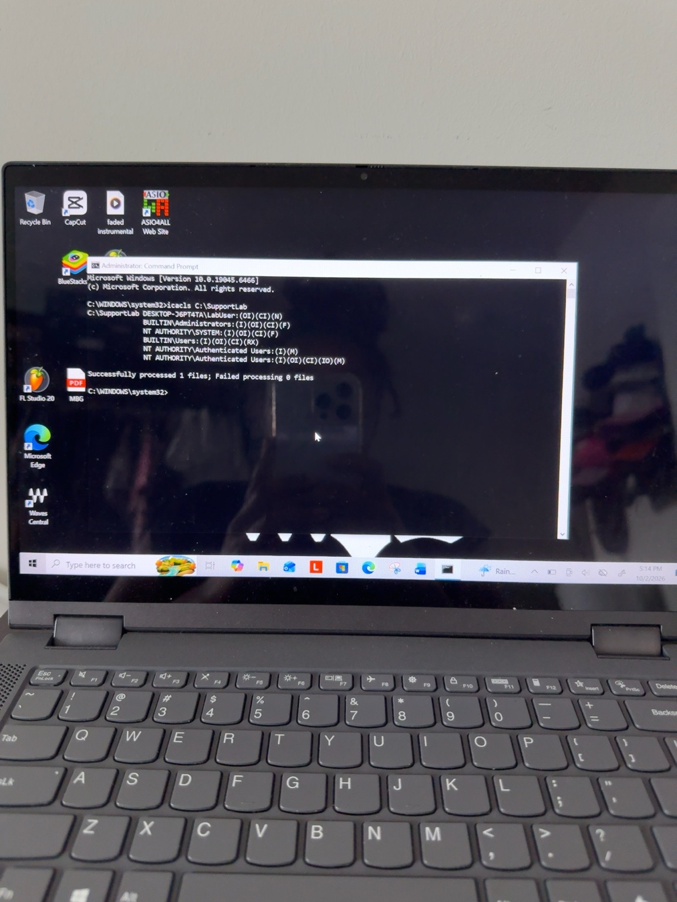
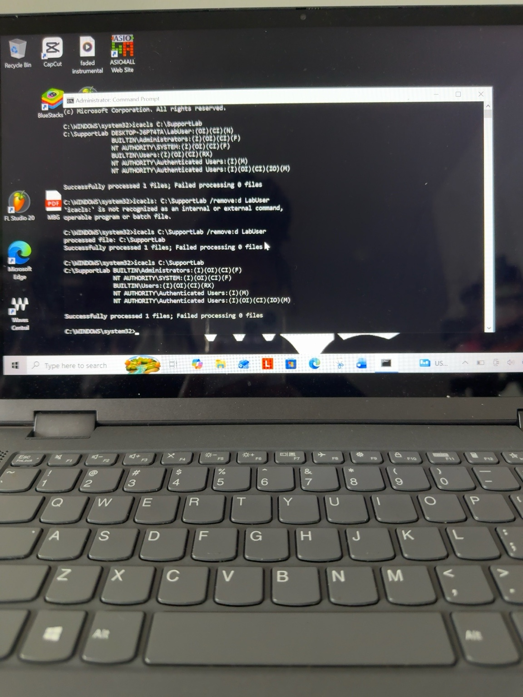
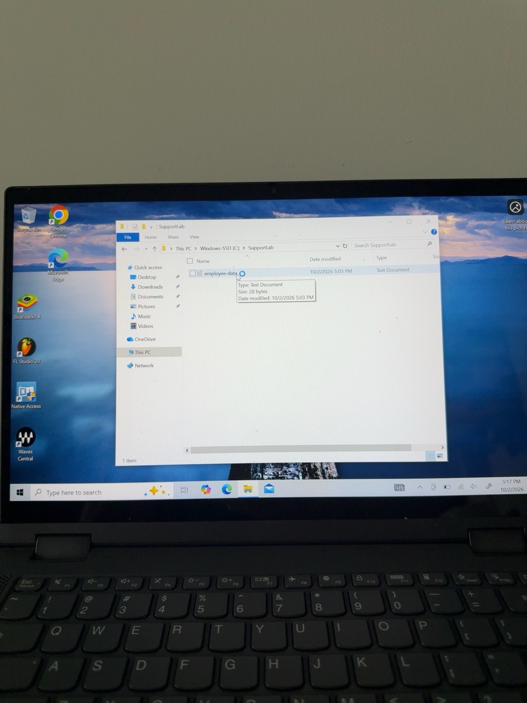

# Windows File Permissions Troubleshooting Lab

## Scenario
A standard Windows user was unable to access a required folder. I created a controlled home-lab scenario to troubleshoot the access issue, identify the cause, correct the permissions, and verify that access was restored.

## Environment
- Windows 10
- Local standard user account
- NTFS file permissions
- Command Prompt
- ICACLS

## 1. Created the Test User

I created a local standard user named `LabUser` and verified that the account was active and belonged to the Users group.

## 2. Created the Support Folder

I created `C:\SupportLab` and added a test file named `employee-data.txt`.

## 3. Created the Permission Issue

To simulate a user access problem, I added an explicit DENY permission for LabUser using ICACLS.

`icacls C:\SupportLab /deny LabUser:(OI)(CI)F`

## 4. Reproduced the User's Issue

I signed into the LabUser account and attempted to access the SupportLab folder.

Windows displayed:

"You don't currently have permission to access this folder."

## 5. Investigated the Permissions

From an elevated Command Prompt, I inspected the folder's access control list:

`icacls C:\SupportLab`

The results showed an explicit DENY entry associated with LabUser.

## 6. Applied the Fix

I removed the incorrect DENY permission:

`icacls C:\SupportLab /remove:d LabUser`

I then ran `icacls C:\SupportLab` again to verify that the LabUser DENY entry had been removed.

## 7. Verified User Access

I signed back into the LabUser account and opened `C:\SupportLab`.

The folder opened successfully and `employee-data.txt` was accessible.

## Resolution

The access issue was caused by an explicit DENY permission assigned to the local user. After identifying and removing the incorrect permission, I verified that the affected user could access the folder successfully.

## Skills Practiced

- Windows troubleshooting
- NTFS permissions
- Local user account management
- Access Control Lists (ACLs)
- ICACLS
- Command Prompt
- Root cause analysis
- Access troubleshooting
- Verification and testing
- Technical documentation

## What I Learned

This lab gave me hands-on practice troubleshooting a Windows access issue from beginning to end: reproducing the problem, investigating permissions, identifying the root cause, applying a fix, and verifying the resolution from the affected user's account.
